<h2 align="center">👋 Hello!</h2>

  <a href="https://a-cup-of.coffee">Blog</a> •
  <a href="https://twitter.com/thebidouilleur">Twitter</a>

- 🔭 I’m currently working at [Lucca](https://www.lucca.fr/).
- 🌱 I’m currently learning more on [HCI](https://www.hpe.com/emea_europe/en/what-is/hyperconverged-infrastructure.html), Golang, and better [X-as-code](https://quadralogics.com/research/XAsCode.html) practices.
- 💬 Ask me about **Containers, Kubernetes and Python**
- 📫 How to reach me: [@TheBidouilleur](https://twitter.com/TheBidouilleur) on Twitter

       

 -------

**📝 Latest Blog Posts**

<!-- BLOG-POST-LIST:START -->
- [GoAuthentik from A to Y](https://a-cup-of.coffee/blog/goauthentik/)
- [Istio from A to Y](https://a-cup-of.coffee/blog/istio/)
- [Awtrix Ulanzi + Domotic = ❤️](https://a-cup-of.coffee/blog/awtrix3-ulanzi-home-assistant/)
- [Falco from A to Y](https://a-cup-of.coffee/blog/falco/)
- [Yubikey and GPG: Securing Your Communications](https://a-cup-of.coffee/blog/yubikey/)
<!-- BLOG-POST-LIST:END -->

-------

**❄️ Nix packages I maintain**
<!-- NIX-PACKAGES:START -->
- [cloudflared](https://www.cloudflare.com/products/tunnel)
- [netmaker](https://netmaker.io)
- [terraform](https://www.terraform.io/)
<!-- NIX-PACKAGES:END -->

-------

### Stats

 

  

 

  

